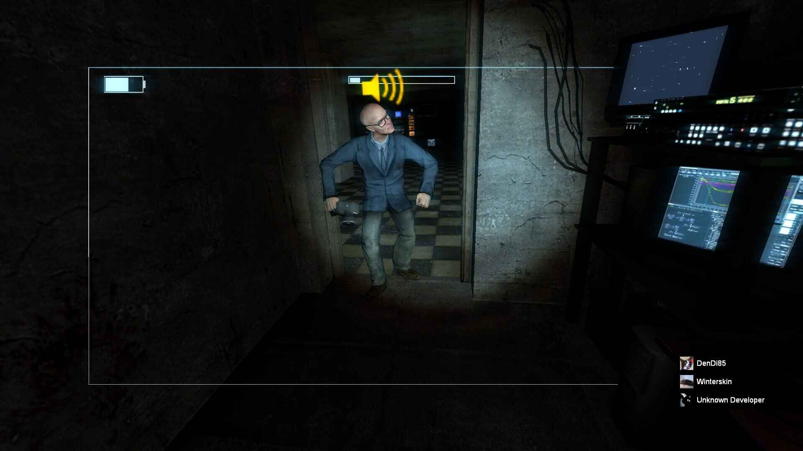
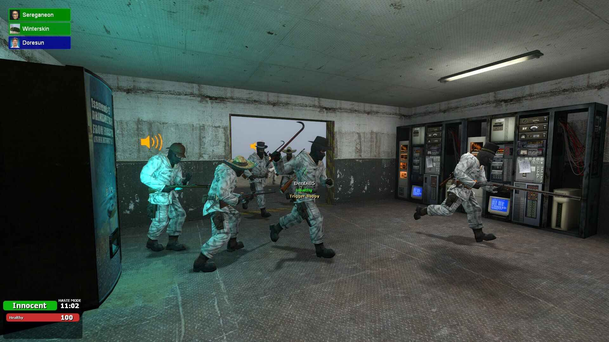
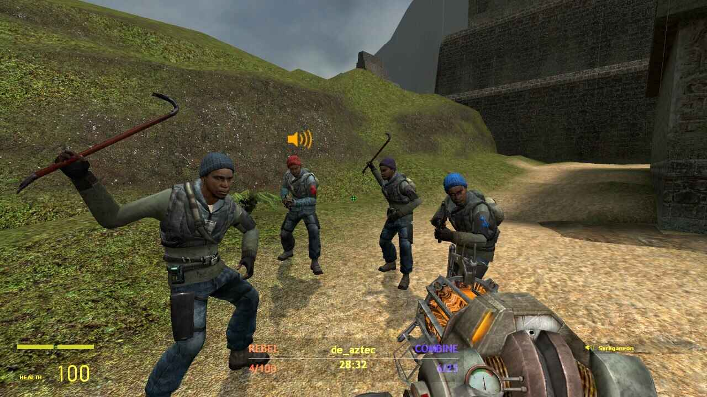
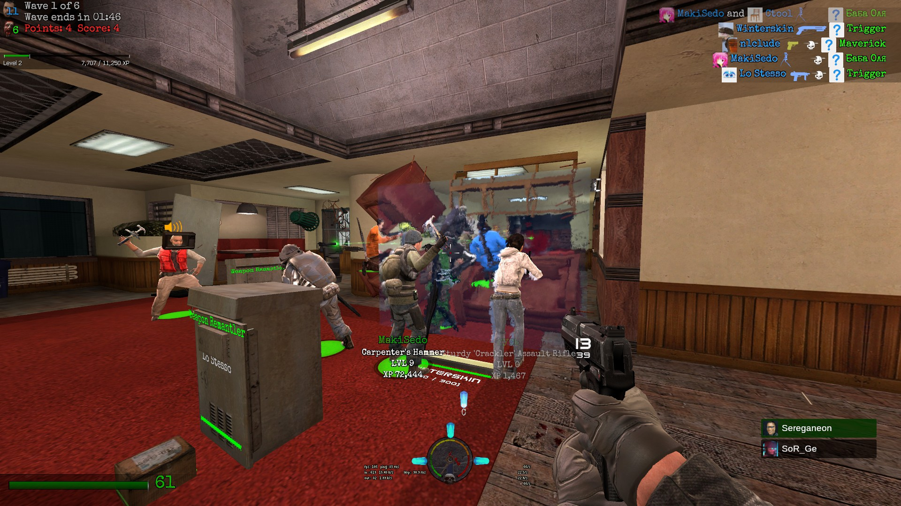

# Welcome!

## *Playing non-roleplay gamemodes and drinking tea since 2018.*

The Alium Community is an international group of Garry's Mod players and developers that has been regularly organizing projects, playing in non-roleplay gamemodes, and just having a great time together.

Members of The Alium Сommunity are connected by a long history and hundreds of hours spent playing the game. Community members are talented people who write reports based on game topics, make analytical videos and machinimas, write reviews, create and modify gamemodes, create maps, organize tournaments, and participate in them.

The Alium Сommunity has a large documented legacy in the form of publications in the workshop, analytical or funny videos on YouTube, as well as numerous posts in discussions and announcements in the Steam group. The structure of the group is defined by detailed, actual concepts and divides the community into units.

{{<
carousel
interval=2000
images="{images/posters/2025_01.png,images/arts/argax_us_gaming.png,images/posters/2025_12.png,images/posters/dendi85.png,images/screenshots/toilet.png,images/posters/miku.png,images/arts/argax_us_flight.png}"
>}}

---

## «HOW TO PLAY WITH YOU?»
**“HOW TO PLAY WITH YOU?”** : To play with us, you can join our events simply through the server browser. To receive notifications about when the game starts, just go to the community's [Discord server](https://discord.gg/UKeB7Bk2JN) and pay attention to the notifications in the **#events** channel.

## «HOW DO I JOIN YOU?»
**“HOW DO I JOIN YOU?”**: Official membership in the group begins after your application to the [Steam group](https://steamcommunity.com/groups/thealium) has been approved. To join the group, you need *100 hours* in Garry's Mod, an *open* and *presentable profile*, no connections to *persona non grata*, and no blocks on the general *ban list*. Once accepted, you will be able to attend meetings, participate in tournaments, comment on posts, vote on community sanctions, etc. For more information, please contact the [technical account](https://steamcommunity.com/id/ericksmaid/).

## «HOW TO GET UNBANNED?»
**“HOW TO GET UNBANNED?”** : The group has a rule that if a player has been permanently banned on our friends servers, this ban is automatically transferred to The Alium community and recognized as valid. You can get the ban lifted by negotiating with the server that banned you or by paying a fine directly to The Alium community. For more information, please contact the [technical account](https://steamcommunity.com/id/ericksmaid/)

---





## GROUP COMPOSITION
The group composition is presented in a table in English to avoid translation inaccuracies and ensure quick updates. You can view the group composition here:


## ARTICLES AND POSTS
The current concept stipulates that the community records important events in the game and writes reports based on information about them. Along with the articles, the community publishes posts related to the group. You can view the announcements here:

