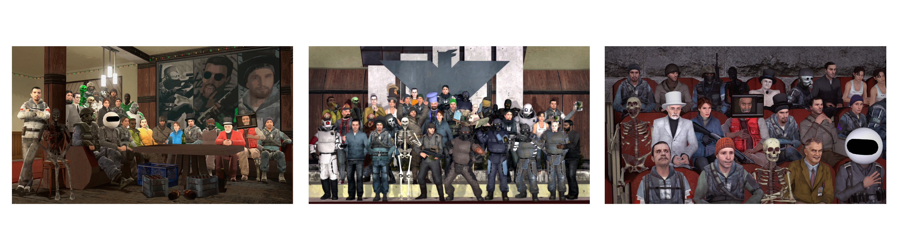
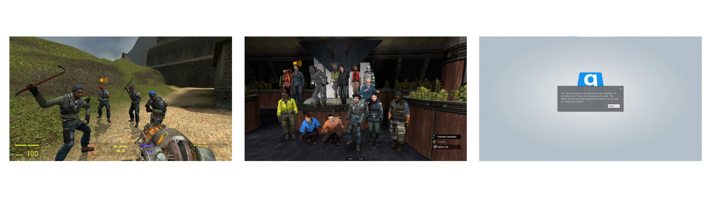

# Добро пожаловать!

Алиумское сообщество — это интернациональная группа игроков и разработчиков в Garry's Mod, которая регулярно организовывает проектные работы, игры в неролевых режимах, и просто отлично проводит время вместе начиная с 2018 года.

Членов алиумского сообщества связывает долгая история и сотни часов проведенного в игре времени. Члены сообщества — талантливые люди, которые пишут доклады на базе игровых тем, снимают аналитические видео и машинимы, пишут рецензии, создают и модифицируют игровые режимы, создают карты, организовывают турниры и участвуют в них.

Алиумское сообщество имеет большое задокументированное наследие в виде публикаций в мастерской, аналитических или смешных видео на YouTube, а также множество постов в обсуждениях и объявлениях в группе Steam.

Устройство группы определяется детально расписанными актуальными концепциями и делит сообщество на подразделения.

## «КАК ИГРАТЬ С ВАМИ?»
«КАК ИГРАТЬ С ВАМИ?» : чтобы играть с нами вы можете присоединится к нашим событиям просто через браузер серверов. Чтобы получать оповещение о том, когда начинается игра достаточно зайти на Discord сервер сообщества и обращать внимание на оповещения в канале #events.[*](https://discord.gg/UKeB7Bk2JN)

## «КАК ПРИСОЕДИНИТЬСЯ К ВАМ?»
«КАК ПРИСОЕДИНИТЬСЯ К ВАМ?» : официальное членство в группе наступает после того, как вашу заявку в Steam группу одобрили.[*](https://steamcommunity.com/groups/thealium) Для того, чтобы вступить в группу вам нужно 100 часов в Garry’s Mod, открытый и презентабельный профиль, отсутствие связей с персонами нон грата, отсутствие блокировки в общем банлисте. После принятия у вас появляется возможность заходить на сборы, участвовать в турнирах, комментировать публикации, голосовать в санкциях сосбщества и т.д. За дополнительной информацией обратитесь к техническому аккаунту.[*](https://steamcommunity.com/id/ericksmaid/)

## «КАК ПОЛУЧИТЬ РАЗБАН?»
«КАК ПОЛУЧИТЬ РАЗБАН?» : в группе реализовано правило, что если игрок получил перманентную блокировку на серверах наших друзей, то эта блокировка автоматически переносится в Алиумское сообщество и признается правомочной. Снять бан можно договорившись с сервером, на котором вас забанили, или же выплатив штраф непосредственно в Алиумском сообществе. За дополнительной информацией обратитесь к техническому аккаунту.[*](https://steamcommunity.com/id/ericksmaid/)

## СОСТАВ ГРУППЫ
Состав группы оформлен в виде таблицы на английском языке, чтобы избежать неточностей переводов и обеспечить быстрое обновление информации. Просмотреть состав группы можно здесь.
