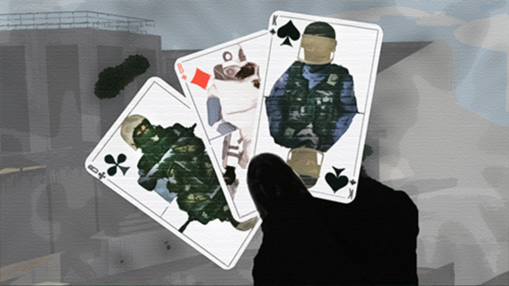

---

В связи с незаинтересованностью сообщества к выполнению какой-то элементарной групповой работы, я вынужден объявить о провале **Проекта Обширной Реставрации и Публикации Архивных карт Counter-Strike:Source** и начать поиск новых игроков.

В будущем будет ставиться приоритет на одиночные проекты, которые не будут проходить под эгидой группы, то есть исключительно под моим контролем и с моей ответственностью.

Отныне, у каждого участника группы, во всех значениях этого слова, нет обязанностей. Также удалено модераторское место под системного администратора, осознавая силы сообщества, я также понимаю, что я не смогу держать сервер. Благодарю за то, что хотя бы успели посчитать.

