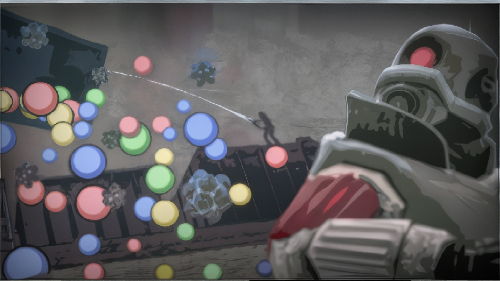

---

One can confidently say that the update from November 12, 2025, for **Garry's Mod** will be the last one this year. It introduces a small number of minor new features and a large number of even smaller bug fixes.

Many changes are being introduced regarding NPCs: Combine soldiers will no longer stand in a T-pose when using pistols; shooting animations from the rocket launcher have also been added for them, and for the Resistance, in addition to rocket launcher shooting animations, animations for the crossbow have been introduced. Now, Kleiner, Eli, Magnusson, Mossman, and Breen can be given weapons upon spawning. A hacked Resistance mine has been added to the spawn menu, and numerous Lua functions for NPCs have been implemented.

Some graphical improvements have been introduced for the Water shader, thanks to one of which the 3D skybox is reflected in the water on gm_construct. The Lightmapped_4WayBlend shader has been implemented for brushes, which allows blending up to 4 images in a texture.

The display of non-Latin characters in fonts used in Sandbox has been improved. The console command sv_pause_sp has been added, which allows not pausing the server in single-player mode. The face poser now has a button that allows setting random values for each category of facial elements.

Despite the voluminous list of various changes, additions, and improvements, this update is inferior to the previous one in significance—which is quite expected. The introduction of Counter-Strike: Source content was such an important event that only a full port of the game to x64 could surpass it. Nevertheless, the game continues to get better, and the changes in the November update contribute to that.

