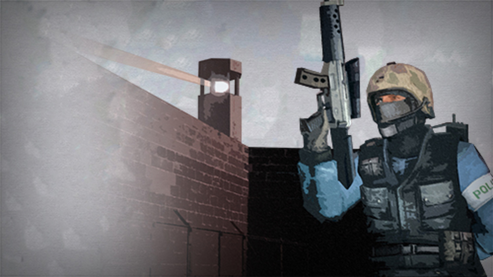

---

For several months, the **Alium community** has been assisting the Persona Grata, **Unknown Developer**, with the development and testing of a game mode that has now been released in the **workshop** under the title **JailBreak: Unknown's Cut**. Today, we can announce that the game mode is complete, marking its official release in the **Steam Workshop**.

The history of the **JailBreak** game concept in **Garry's Mod** has not seen any successful, long-term implementations. This is evident from the low popularity of this mode in the public server browser, which is more than understandable. There is no standard for this mode that follows a Plug and Play principle. The best version of JailBreak in the workshop until now was a release by user **Clark**, who created it back in 2017 for the **Garry's Mod Gamemode Competition** hosted by **GmodStore**.

There is no doubt that if **Unknown Developer** had participated in that competition, he could have walked away with prize money, but this version of **JailBreak** is being released as an independent publication.

Previously, a classic version of **JailBreak** was attempted by **Minerva** officer **Bilwin**, but no public results from that effort exist; all developments remained with the developer and have likely not been used anywhere since 2022.

Referring to the evaluation of game modes by **RoboKnife**, the newly released version of **JailBreak** does not stand out for its single-player features or competitiveness. This can be explained by the fact that the game mode is entirely designed for friendly interaction among players; there is little for solo players to engage with. However, this does not mean that the mode does not serve as an example for others. On the contrary, the game mode is exemplary in many other aspects.

[JailBreak: Unknown's Cut - Gamemode in the workshop](https://steamcommunity.com/sharedfiles/filedetails/?id=3211331044)

