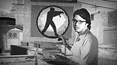

Художественный дизайн игры имеет важное значение для создания её атмосферы и влияет на восприятие игрока. Люди, способные формировать его в чёткую концепцию с отдельными выделяющимися элементами и имеют способности воплощать эти концепции в жизнь — крайне дорогие для игровой индустрии. К сожалению, потеря такого талантливого специалиста, способного не только видеть общую картину, но и воплощать её в мельчайших деталях, становится невосполнимой утратой для очень большого числа людей.

Шестнадцатого февраля 2025 года стало известно о смерти главного **арт-дизайнера** **Half-Life 2**, **Half-Life 2: Lost Coast**, автора дизайнерских решений **Counter-Strike: Source** **Виктора Антонова**. Об этом изначально стало известно от компании, одним из основателей которой являлся Виктор Антонов — Eschatology Entertainment. Компания сделала публикацию в LinkedIn, в которой подтвердила смерть на 9 февраля, причин смерти не указала. Eschatology Entertainment заявили, что еще ожидают официальные бумаги. Множество других разработчиков также выразили свои соболезнования и поделились своим опытом работы с Антоновым в комментариях к публикации или в своих социальных сетях, в том числе и **Марк Лэйдлоу** опубликовал историю в Instagram.

Деятельность **Виктора Антонова** ограничивалась одной отраслью, в которой он всегда преуспевал — арт-дизайном. За счёт уникального видения, основанного на индустриализации, а также архитектуры восточной Европы, **Half-Life 2** обрела великолепно подходящий её сеттингу вид, которым мы до сих пор пользуемся при создании контента в **Garry's Mod**.

Пусть множество людей и не знало Антонова лично, однако он внес большой вклад и оставил огромное наследие, которое находится перед глазами каждый день.

---

